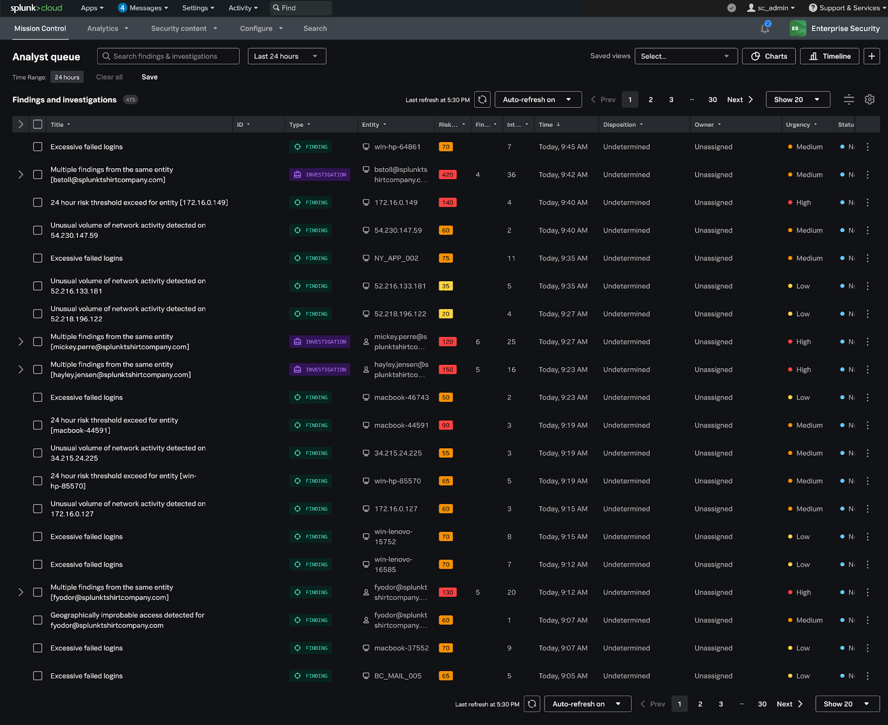
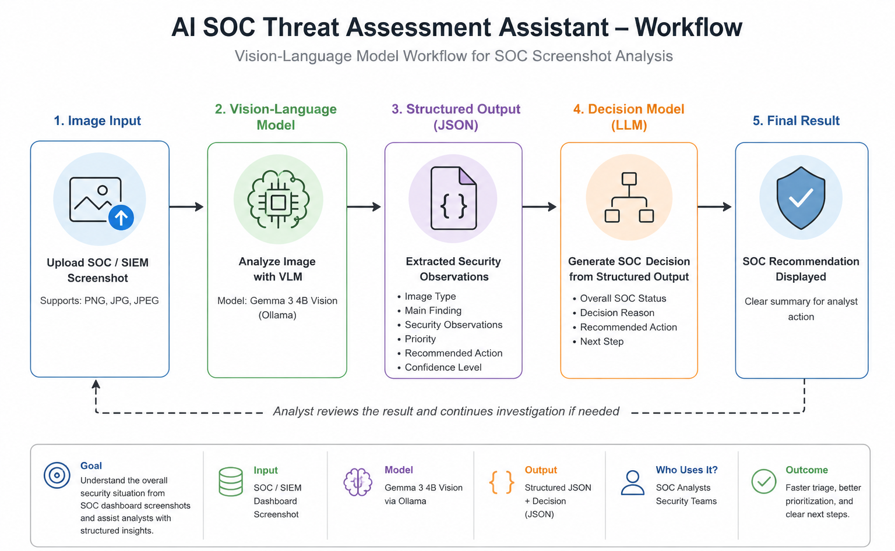

# AI SOC Threat Assessment Assistant

A simple Vision-Language Model workflow that analyzes SOC/SIEM dashboard screenshots using Gemma 3 Vision. The application generates a structured security assessment, then uses a second AI stage to produce an overall SOC decision and recommended action.

## Demo

🎥 **Project Demo:** [AI SOC Threat Assessment Assistant Demo]([https://youtu.be/KTNTr53sIlM](https://youtu.be/KTNTr53sIlM?si=vLLDkDaBbmgi_Yq4))

---

## Use Case

The tool analyzes SOC/SIEM screenshots (Splunk dashboards) and produces:

- Structured security observations
- Threat categories
- Priority levels
- Recommended actions
- Overall SOC decision

---
## Project Structure

```
AI-SOC-Threat-Assessment-Assistant/
│
├── images/
│   ├── splunk_analyst_queue.png
│   └── splunk_dashboard.jpg
│
├── diagrams/
│   └── VLM-workflow-diagram.png
│
├── analyzer.py
├── prompts.py
├── app.py
├── requirements.txt
└── README.md
```

---

## Vision-Language Model

| Component | Technology |
|------------|------------|
| Model | Gemma 3 4B Vision |
| Runtime | Ollama |
| Frontend | Streamlit |

### Why Ollama?
I chose to run the model locally with Ollama because it enabled unlimited experimentation without API usage limits. This allowed faster prompt refinement, easier debugging, and more efficient workflow development. Since the goal of this project was to understand and implement an AI workflow, having the freedom to experiment and iterate repeatedly was especially valuable during the learning process.

---

## Prompt Engineering

The workflow is driven by two prompts to separate image understanding from decision making. This modular design makes the workflow easier to extend and maintain.

### 1. SOC Analysis Prompt

The Vision-Language Model analyzes the uploaded screenshot and generates a structured JSON summary of the overall security situation.

### 2. SOC Decision Prompt

The structured JSON is sent back to the model to generate an overall SOC decision and recommended next step.

---

## Example Input



---

## Example Structured Output

```json
{
  "image_type": "SOC/SIEM Dashboard",
  "platform": "Splunk Cloud",
  "main_finding": "Multiple authentication and network-related security findings requiring investigation.",
  "security_observations": [
    {
      "issue": "Repeated authentication findings",
      "possible_threat": "Credential Attack",
      "priority": "High",
      "recommended_action": "Review authentication logs"
    },
    {
      "issue": "Multiple network activity findings",
      "possible_threat": "Suspicious Network Activity",
      "priority": "Medium",
      "recommended_action": "Review network activity"
    },
    {
      "issue": "Correlated security findings across multiple entities",
      "possible_threat": "Correlated Security Findings",
      "priority": "Medium",
      "recommended_action": "Correlate related findings"
    }
  ],
  "confidence_level": "High",
  "recommended_next_step": "Assign to SOC analyst"
}
```

---

## Example Decision Output

```json
{
  "overall_soc_status": "Elevated Risk",
  "decision_reason": "High-priority authentication findings are present alongside multiple related network security observations.",
  "recommended_action": "Assign to SOC analyst",
  "next_step": "Continue investigation"
}
```
---
### Why JSON?

I chose JSON because it provides a structured representation of the extracted security observations. Organizing the output into consistent fields makes it easier for the second AI stage to process the information and supports future security automation.

---

## Workflow Structure

The application follows a simple two-stage AI workflow:
<p align="center">
  
</p>

The goal is not OCR or reading every row in the dashboard. Instead, the model understands the overall security situation and summarizes the visible security patterns into structured data.

---

## How to Run

1. Clone this repository.

2. Install **Ollama**.

3. Pull the Vision-Language Model:

```bash
ollama pull gemma3:4b
```

4. Install the required dependencies:

```bash
pip install -r requirements.txt
```

5. Make sure the Ollama service is running.

6. Start the Streamlit application:

```bash
python -m streamlit run app.py
```

7. Open the local URL displayed in the terminal (`http://localhost:xxxx`), upload a SOC/SIEM screenshot, and click **Analyze Image**.

---

## AI Assistance

AI tools were used to:

- Brainstorm the workflow
- Review and debug the code
- Refine the prompts
- Suggest improvements to the output structure
- Improve the JSON formatting

All AI-generated suggestions were reviewed, tested, and validated before being included in the final project.
  
---

## Challenges

During development, I faced several challenges:

- Selecting the most suitable Vision-Language Model required evaluating multiple local models and cloud APIs before choosing **Gemma 3 Vision with Ollama**.
- Early prompt versions produced OCR-style responses instead of high-level security analysis.
- The model occasionally generated hallucinated information that was not present in the screenshot.
- Achieving a consistent JSON structure across different screenshots required multiple prompt refinements.
- Designing a clear separation between the image analysis stage and the decision generation stage required several workflow iterations.

---

## My Contributions

I designed and implemented:

- The complete AI workflow
- Prompt engineering and iterative refinement
- Structured JSON format
- Two-stage reasoning workflow
- Streamlit interface
- Error handling for invalid model outputs

I also refined the prompts several times to reduce hallucinations and improve output consistency.

---

## Future Improvements

- Support multiple SIEM platforms
- Support batch analysis for multiple screenshots
- Improve prompt robustness
- Generate downloadable security reports
